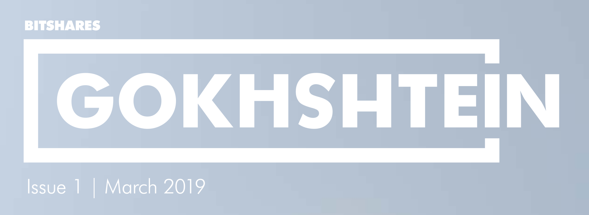

# Articles / Interviews

## BitShares Severly Underrated? (March 2019)

**Cover feature in Gokhshtein**

The article introduction and interview questions were written by Gokhshtein team, the answers and complete review was done by Blockchain Projects BV (Fabian Schuh and Stefan Schießl). Funded by [marketing worker](https://www.bitshares.foundation/workers/2019-02-marketing-interviews-articles-and-visibility).

Source
 - Full magazine https://gokhshtein.com/product/gokhshtein-magazine-march-2019/ (free sample inside)
 - BitShares Exclusive Feature https://gokhshtein.com/product/bitshares-information/
 
Advertisement (not exhaustive)
 - Available as print version e.g. at Boston BUIDL Hackathon, and [2050 conference](general/2050-gokhshtein.jpg)
 - https://twitter.com/davidgokhshtein/status/1108110904330240000
 - https://twitter.com/gokhshtein/status/1108352766580310017
 - https://twitter.com/gokhshtein/status/1123301173325385730

Article and Interview as PDF 
 - [Fill Magazine Teaser - BitShares Severly Underrated?](general/en%20-%20BitShares%20Severly%20Underrated%20-%20Gokhshtein.pdf)  
 - [English Featured - BitShares Severly Underrated?](general/en%20-%20BitShares%20Severly%20Underrated%20-%20Gokhshtein.pdf)
 - [Chinese Featured - BitShares Severly Underrated?](general/zh%20-%20Featured%20-%20BitShares%20Severely%20Underrated.pdf)

## BitShares: A fully decentralized platform & community (February 2019)

**Article on FortuneJack** 

The questions were written by LordCatoshi (Telegram @Kattenkoning), the answers and review was done by Blockchain Projects BV (Fabian Schuh and Stefan Schießl). Special thanks to CryptoKong (Telegram @Cryptokong123) from the DEXBot team for establishing contact.

Source
 - https://fortunejack.com/blog/article/bitshares-a-fully-decentralized-platform-community
